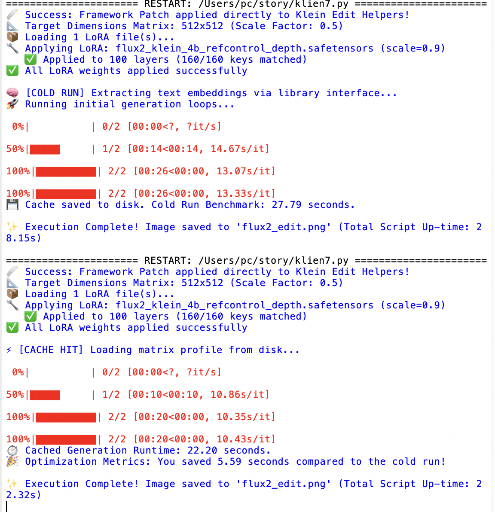

[](https://pypi.org/project/mflux/)
[](https://pypi.org/project/mlx/)
[](https://github.com/filipstrand/mflux/actions/workflows/tests.yml)

### About

Run the modified state-of-the-art generative image models locally on your Mac in native MLX!



Code for test

```python
#!/usr/bin/env -S uv run --script
# /// script
# requires-python = ">=3.10"
# dependencies = [
#   "mflux",
# ]
# ///
import os
import sys
import time

# =========================================================================
# FORCE-LOAD & PATCH: Targets the exact helper module causing the crash
# =========================================================================
try:
    # 1. Force Python to load the exact file containing the bug
    import mflux.models.flux2.variants.edit.flux2_klein_edit_helpers as helpers
    
    # 2. Extract the encoder class directly from that loaded helper module
    if hasattr(helpers, "Flux2PromptEncoder"):
        encoder_cls = helpers.Flux2PromptEncoder
        _original_encode_prompt = encoder_cls.encode_prompt

        @classmethod
        def _safe_encode_prompt(cls, *args, **kwargs):
            # Intercept and drop the breaking parameter right before execution
            kwargs.pop("num_images_per_prompt", None)
            return _original_encode_prompt(*args, **kwargs)

        # Rebind it directly inside the helper context
        encoder_cls.encode_prompt = _safe_encode_prompt
        print("🩹 Success: Framework Patch applied directly to Klein Edit Helpers!")
    else:
        print("⚠️ Flux2PromptEncoder not found in helper module attributes.")
except Exception as patch_err:
    print(f"⚠️ Direct patch binding failed: {patch_err}")

# =========================================================================
# MAIN EXECUTION CORE
# =========================================================================
from mflux.callbacks.instances.battery_saver import BatterySaver
from mflux.callbacks.instances.memory_saver import MemorySaver
from mflux.models.common.config import ModelConfig
from mflux.models.flux2.variants import Flux2KleinEdit
import mlx.core as mx
import numpy as np

# Global configuration & scaling factors
SCALE_FACTOR = 0.5  
BASE_WIDTH = 1024
BASE_HEIGHT = 1024

TARGET_WIDTH = int((BASE_WIDTH * SCALE_FACTOR) // 32) * 32
TARGET_HEIGHT = int((BASE_HEIGHT * SCALE_FACTOR) // 32) * 32

print(f"📐 Target Dimensions Matrix: {TARGET_WIDTH}x{TARGET_HEIGHT} (Scale Factor: {SCALE_FACTOR})")

# Initialize Local Model Instance (Optimized 4-bit Quantization)
model_config = ModelConfig.flux2_klein_4b()
model = Flux2KleinEdit(
    model_config=model_config,
    lora_paths=["thedeoxen/refcontrol-FLUX.2-klein-4B-reference-depth-lora"],
    lora_scales=[0.9],
    quantize=4
)

# Rigorous resource managers tailored for running models on local unified memory architecture
model.callbacks.register(BatterySaver(battery_percentage_stop_limit=20))
model.callbacks.register(MemorySaver(model=model, keep_transformer=False))

prompt = "refcontrol"
cache_file = "prompt_embeddingss.npz"
image = None

# =========================================================================
# EXECUTION & TIME BENCHMARKING PIPELINE
# =========================================================================
global_start_time = time.time()

# Case 1: Checking for pre-computed array weight cache (PROMPT DID NOT CHANGE)
if os.path.exists(cache_file):
    try:
        data = np.load(cache_file, allow_pickle=True)
        if 'prompt' in data and str(data['prompt']) == prompt:
            print("\n⚡ [CACHE HIT] Loading matrix profile from disk...")
            baseline_run_time = data['baseline_time'] if 'baseline_time' in data.files else None
            
            case1_start = time.time()
            prompt_embeds = mx.array(data['prompt_embeds'])
            text_ids = mx.array(data['text_ids'])
            
            image = model.predict(
                prompt_embeds=prompt_embeds,
                text_ids=text_ids,
                image_paths=["2d.png", "u.png"],
                width=TARGET_WIDTH,   
                height=TARGET_HEIGHT, 
                num_inference_steps=2,
                seed=42,
            )
            cached_execution_duration = time.time() - case1_start
            print(f"⏱️ Cached Generation Runtime: {cached_execution_duration:.2f} seconds.")
            
            if baseline_run_time:
                print(f"🎉 Optimization Metrics: You saved {float(baseline_run_time) - cached_execution_duration:.2f} seconds compared to the cold run!")
        else:
            print("🔄 Prompt mutation or corrupted archive detected. Invalidating old cache.")
            os.remove(cache_file)
    except Exception as e:
        print(f"⚠️ Cache read error: {e}")
        if os.path.exists(cache_file): 
            try: os.remove(cache_file)
            except: pass

# Case 2: Cache Miss / Cold Run
if image is None:
    print("\n🧠 [COLD RUN] Extracting text embeddings via library interface...")
    case2_start = time.time()
    
    # Extract structural tuples cleanly via library interface patch
    prompt_embeds, text_ids = model.encode_prompt(prompt)
    
    print("🚀 Running initial generation loops...")
    image = model.predict(
        prompt_embeds=prompt_embeds,
        text_ids=text_ids,
        image_paths=["2d.png", "u.png"],
        width=TARGET_WIDTH,   
        height=TARGET_HEIGHT, 
        num_inference_steps=2,
        seed=42,
    )
    cold_execution_duration = time.time() - case2_start
    
    # Force evaluate arrays to materialize unified memory weights before conversion
# Force evaluate arrays to materialize unified memory weights before conversion
# Force evaluate arrays to materialize unified memory weights
    mx.eval(prompt_embeds, text_ids)
    
    # FIX: Convert to native Python lists first to completely bypass the PEP 3118 buffer protocol
    np.savez(
        cache_file, 
        prompt=prompt, 
        prompt_embeds=np.array(prompt_embeds.tolist(), dtype=np.float32), 
        text_ids=np.array(text_ids.tolist(), dtype=np.int32),
        baseline_time=cold_execution_duration
    )
    print(f"💾 Cache saved to disk. Cold Run Benchmark: {cold_execution_duration:.2f} seconds.")
if image is not None:
    image.save("flux2_edit.png")
    total_script_time = time.time() - global_start_time
    print(f"\n✨ Execution Complete! Image saved to 'flux2_edit.png' (Total Script Up-time: {total_script_time:.2f}s)")

```

### Table of contents

- [💡 Philosophy](#-philosophy)
- [💿 Installation](#-installation)
- [🎨 Models](#-models)
- [✨ Features](#-features)
- [🌱 Related projects](#related-projects)
- [🙏 Acknowledgements](#-acknowledgements)
- [⚖️ License](#%EF%B8%8F-license)

---

### 💡 Philosophy

MFLUX is a line-by-line MLX port of several state-of-the-art generative image models from the [Huggingface Diffusers](https://github.com/huggingface/diffusers) and [Huggingface Transformers](https://github.com/huggingface/transformers) libraries. All models are implemented from scratch in MLX, using only tokenizers from the [Huggingface Transformers](https://github.com/huggingface/transformers) library. MFLUX is purposefully kept minimal and explicit, [@karpathy](https://gist.github.com/awni/a67d16d50f0f492d94a10418e0592bde?permalink_comment_id=5153531#gistcomment-5153531) style.

---

### 💿 Installation
If you haven't already, [install `uv`](https://github.com/astral-sh/uv?tab=readme-ov-file#installation), then run:

```sh
uv tool install --upgrade mflux
```

After installation, the following command shows all available MFLUX CLI commands: 

```sh
uv tool list 
```

To generate your first image using, for example, the z-image-turbo model, run

```
mflux-generate-z-image-turbo \
  --prompt "A puffin standing on a cliff" \
  --width 1280 \
  --height 500 \
  --seed 42 \
  --steps 9 \
  -q 8
```


The first time you run this, the model will automatically download which can take some time. See the [model section](#-models) for the different options and features, and the [common README](src/mflux/models/common/README.md) for shared CLI patterns and examples.

<details>
<summary>Python API</summary>

Create a standalone `generate.py` script with inline `uv` dependencies:

```python
#!/usr/bin/env -S uv run --script
# /// script
# requires-python = ">=3.10"
# dependencies = [
#   "mflux",
# ]
# ///
from mflux.models.z_image import ZImageTurbo

model = ZImageTurbo(quantize=8)
image = model.generate_image(
    prompt="A puffin standing on a cliff",
    seed=42,
    num_inference_steps=9,
    width=1280,
    height=500,
)
image.save("puffin.png")
```

Run it with:

```sh
uv run generate.py
```

For more Python API inspiration, look at the [CLI entry points](src/mflux/models/z_image/cli/z_image_turbo_generate.py) for the respective models.
</details>

<details>
<summary>⚠️ Troubleshooting: hf_transfer error</summary>

If you encounter a `ValueError: Fast download using 'hf_transfer' is enabled (HF_HUB_ENABLE_HF_TRANSFER=1) but 'hf_transfer' package is not available`, you can install MFLUX with the `hf_transfer` package included:

```sh
uv tool install --upgrade mflux --with hf_transfer
```

This will enable faster model downloads from Hugging Face.

</details>

<details>
<summary>DGX / NVIDIA (uv tool install)</summary>

```sh
uv tool install --python 3.13 mflux
```
</details>

---

### 🎨 Models

MFLUX supports the following model families. They have different strengths and weaknesses; see each model’s README for full usage details.

| Model | Release date | Size | Type | Training | Description |
| --- | --- | --- | --- | --- | --- |
|[Z-Image](src/mflux/models/z_image/README.md) | Nov 2025 | 6B | Distilled & Base | Yes | Fast, small, very good quality and realism. |
|[Krea 2](src/mflux/models/krea2/README.md) | Jun 2026 | 12B | Turbo (distilled) | No | Very good quality with a wide range of styles; good for creative exploration. |
|[FLUX.2](src/mflux/models/flux2/README.md) | Jan 2026 | 4B & 9B | Distilled & Base | Yes | Fastest + smallest with very good qaility and edit capabilities. |
|[Ideogram 4](src/mflux/models/ideogram4/README.md) | Jun 2026 | 9B | Base | No | JSON-caption-native, typography-focused text-to-image generation. |
|[ERNIE-Image](src/mflux/models/ernie_image/README.md) | Apr 2026 | 8B | Distilled & Base | No | Single-stream DiT from Baidu. Vivid, high-contrast output. |
|[FIBO](src/mflux/models/fibo/README.md) | Oct 2025+ | 8B | Distilled & Base | No | Very good JSON-based prompt understanding. Has edit capabilities. |
|[SeedVR2](src/mflux/models/seedvr2/README.md) | Jun 2025 | 3B & 7B | — | No | Best upscaling model. |
|[Qwen Image](src/mflux/models/qwen/README.md) | Aug 2025+ | 20B | Base | No | Large model (slower); strong prompt understanding and world knowledge. Has edit capabilities |
|[Depth Pro](src/mflux/models/depth_pro/README.md) | Oct 2024 | — | — | No | Very fast and accurate depth estimation model from Apple. |
|[FLUX.1](src/mflux/models/flux/README.md) | Aug 2024 | 12B | Distilled & Base | No (legacy) | Legacy option with decent quality. Has edit capabilities with 'Kontext' model and upscaling support via ControlNet |

---

### ✨ Features

**General**
- Quantization and local model loading
- LoRA support (multi-LoRA, scales, library lookup)
- Metadata export + reuse, plus prompt file support

**Model-specific highlights**
- Text-to-image and image-to-image generation.
- LoRA finetuning
- In-context editing, multi-image editing, and virtual try-on
- ControlNet (Canny), depth conditioning, fill/inpainting, and Redux
- Upscaling (SeedVR2 and Flux ControlNet)
- Depth map extraction and FIBO prompt tooling (VLM inspire/refine)

See the [common README](src/mflux/models/common/README.md) for detailed usage and examples, and use the model section above to browse specific models and capabilities.

> [!NOTE]
> As MFLUX supports a wide variety of CLI tools and options, the easiest way to navigate the CLI in 2026 is to use a coding agent (like [Cursor](https://cursor.com), [Claude Code](https://www.anthropic.com/claude-code), or similar). Ask questions like: “Can you help me generate an image using z-image?”


---

<a id="related-projects"></a>

### 🌱 Related projects

- [MindCraft Studio](https://themindstudio.cc/mindcraft#models) — macOS app built on mflux by [@shaoju](https://github.com/shaoju)
- [Mflux-ComfyUI](https://github.com/raysers/Mflux-ComfyUI) by [@raysers](https://github.com/raysers)
- [MFLUX-WEBUI](https://github.com/CharafChnioune/MFLUX-WEBUI) by [@CharafChnioune](https://github.com/CharafChnioune)
- [mflux-fasthtml](https://github.com/anthonywu/mflux-fasthtml) by [@anthonywu](https://github.com/anthonywu)
- [mflux-streamlit](https://github.com/elitexp/mflux-streamlit) by [@elitexp](https://github.com/elitexp)
- [mlx-taef](https://github.com/IonDen/mlx-taef) — TAESD/TAEF tiny-autoencoder live previews and low-memory FLUX decode for mflux, by [@IonDen](https://github.com/IonDen)
- [mlx-teacache](https://github.com/IonDen/mlx-teacache) — TeaCache step-skipping to speed up FLUX generation in mflux, by [@IonDen](https://github.com/IonDen)

---

### 🙏 Acknowledgements

MFLUX would not be possible without the great work of:

- The MLX Team for [MLX](https://github.com/ml-explore/mlx) and [MLX examples](https://github.com/ml-explore/mlx-examples)
- Black Forest Labs for the [FLUX project](https://github.com/black-forest-labs/flux)
- Bria for the [FIBO project](https://huggingface.co/briaai/FIBO)
- Tongyi Lab for the [Z-Image project](https://tongyi-mai.github.io/Z-Image-blog/)
- Baidu for the [ERNIE-Image project](https://huggingface.co/baidu/ERNIE-Image)
- Ideogram for the [Ideogram 4 project](https://huggingface.co/ideogram-ai/ideogram-4-fp8)
- Krea.ai for the [Krea 2 project](https://www.krea.ai/blog/krea-2-technical-report)
- Qwen Team for the [Qwen Image project](https://qwen.ai/blog?id=a6f483777144685d33cd3d2af95136fcbeb57652&from=research.research-list)
- ByteDance, @numz and @adrientoupet for the [SeedVR2 project](https://github.com/numz/ComfyUI-SeedVR2_VideoUpscaler)
- Hugging Face for the [Diffusers library implementations](https://github.com/huggingface/diffusers) 
- Depth Pro authors for the [Depth Pro model](https://github.com/apple/ml-depth-pro?tab=readme-ov-file#citation)
- The MLX community and all [contributors and testers](https://github.com/filipstrand/mflux/graphs/contributors)

---

### ⚖️ License

This project is licensed under the [MIT License](LICENSE).
